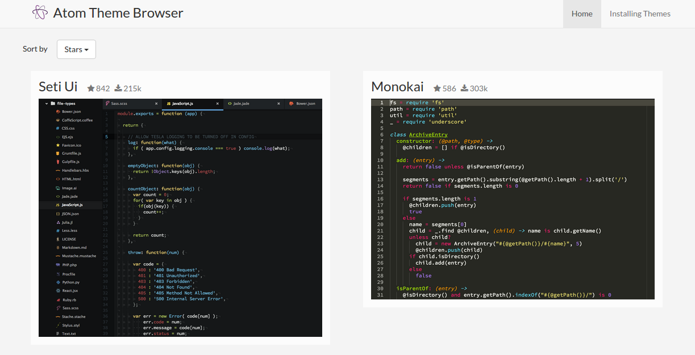

# Atom Theme Browser


## Getting started with rails
```
$ bundle
$ rake db:scheme:load
$ rake update_themes
$ rails server
```
This fetches the dependencies we need, sets up the database, and scrapes atom.io
for the images and info on themes.
